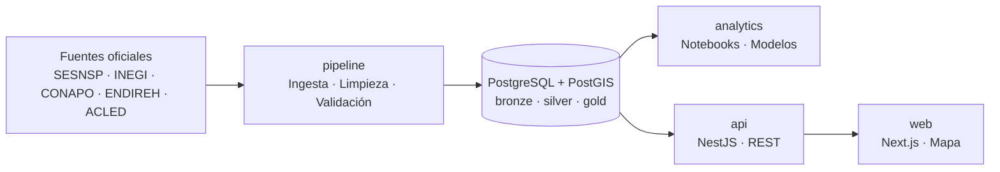

# Chiapas Data Lab

> Plataforma de datos abiertos para explorar la **violencia en todas sus formas** en los 124 municipios de Chiapas, México, con un módulo especial de **violencia de género**, y cómo ambas se relacionan con el **contexto económico, social y cultural** del estado.

**[Ver dashboard en vivo](#)** · **[Documentación de la API](#)** · **[Hallazgos](#hallazgos-principales)**

---

## ¿De qué trata este proyecto?

Chiapas combina altos niveles de pobreza, una enorme diversidad cultural, lingüística y religiosa, y grandes desigualdades entre regiones. Los datos oficiales sobre violencia existen, pero están dispersos en distintas instituciones, con formatos, periodicidades y niveles geográficos diferentes.

Este proyecto reúne esas fuentes en un pipeline automatizado, las integra en una base de datos geoespacial y las presenta en un dashboard interactivo, con análisis estadístico y espacial. Tiene dos niveles:

1. **Violencia general:** homicidio, extorsión, violencia familiar, robo, conflicto armado y demás delitos, junto con su relación con la pobreza y el contexto social.
2. **Módulo de violencia de género:** feminicidio, violencia familiar, delitos sexuales y violencia contra las mujeres, y su relación con factores económicos, sociales, culturales y religiosos.

Se busca encontrar una correlación entre diversos factores, económicos, sociales, religiosos o ideológicos que puedan argumentar o ser causantes del aumento de violencia en el estado, el objetivo de este proyecto no es culpabilizar a un sector o área en concreto si no visualizar la verdad de los datos y poder realizar un análisis basados en los resultados.

## Dimensiones de análisis

| Dimensión | Qué se mide | Ejemplos de indicadores |
|---|---|---|
| **Violencia general** | Incidencia delictiva y conflicto | Homicidio, extorsión, robo, lesiones, eventos de conflicto (ACLED) |
| **Violencia de género** | Delitos y violencia contra las mujeres | Feminicidio, violencia familiar, delitos sexuales, defunciones femeninas con presunción de homicidio, ENDIREH |
| **Económica** | Pobreza, ingresos y actividad económica | Pobreza multidimensional, ENIGH, DENUE |
| **Social** | Educación, marginación, composición de la población | Índice de marginación, rezago educativo, población indígena, ruralidad |
| **Cultural e ideológica** | Composición religiosa y actitudes | Religión (Censo 2020), lengua indígena, actitudes y discriminación (ENADIS) |

## Preguntas que busca responder

**Violencia general**
1. ¿Qué municipios tienen las tasas más altas de delitos por cada 100 mil habitantes?
2. ¿Cómo ha evolucionado la incidencia delictiva en el tiempo y existe estacionalidad?
3. ¿Se relaciona la pobreza con la violencia a nivel municipal? ¿Con qué límites?
4. ¿Existen clústeres geográficos de municipios con alta violencia?
5. ¿Qué tan grande es la brecha entre los delitos denunciados y los reportados en encuestas (cifra negra)?
6. ¿Qué municipios tienen las tasas más altas de violencia de género por cada 100 mil mujeres?
7. ¿La violencia de género sigue los mismos patrones geográficos y temporales que la violencia general, o se comporta distinto?
8. ¿Existe asociación entre la composición religiosa de una región y los indicadores de violencia de género, **una vez controlados** pobreza, ruralidad, población indígena y escolaridad?

## Arquitectura



**Principio de diseño:** solo el pipeline escribe en la base de datos. El resto de los servicios la consulta con un rol de solo lectura, y la comunicación entre ellos se hace mediante contratos (esquema `gold` y OpenAPI), sin compartir código.

## Repositorios

| Repositorio | Rol | Stack | Estado |
|---|---|---|---|
| [`pipeline`](../../data-pipeline) | Ingesta, limpieza, validación, carga, modelos dbt e infraestructura Docker | Python, Pandera, dbt, PostGIS, Docker | En desarrollo |
| [`analytics`](../../analytics) | Análisis exploratorio, estadístico y espacial; reportes reproducibles | Jupyter, GeoPandas, PySAL, statsmodels, Quarto | Pendiente |
| [`api`](../../api) | API REST que sirve los datos procesados | NestJS, TypeScript, Swagger | Pendiente |
| [`web`](../../dashboard-web) | Dashboard interactivo con mapa coroplético | Next.js, Tailwind, MapLibre GL, Recharts | Pendiente |

## Fuentes de datos

| Categoría | Fuente | Qué aporta | Desagregación esperada* |
|---|---|---|---|
| Violencia general | SESNSP | Incidencia delictiva del fuero común (homicidio, extorsión, robo, etc.) | Municipal, mensual |
| Violencia general | INEGI: Estadísticas de Mortalidad | Defunciones por homicidio | Municipal, anual |
| Violencia general | ACLED | Eventos de conflicto y violencia política georreferenciados | Puntos, diario |
| Cifra negra | INEGI: ENVIPE | Victimización y percepción de inseguridad | Estatal |
| Violencia de género | SESNSP | Feminicidio, violencia familiar, delitos sexuales y otras violencias de género | Municipal, mensual |
| Violencia de género | INEGI: ENDIREH | Violencia contra las mujeres (encuesta) | Estatal |
| Violencia de género | SESNSP: llamadas de emergencia 9-1-1 | Llamadas por violencia contra la mujer y familiar | Estatal / municipal |
| Actitudes | INEGI/CONAPRED: ENADIS | Discriminación y actitudes | Nacional / estatal |
| Cultural | INEGI: Censo 2020 | Religión, lengua indígena, población afrodescendiente, escolaridad, población por sexo | Municipal |
| Económica | INEGI: Medición de pobreza | Pobreza y carencias sociales | Municipal |
| Social | CONAPO | Índice de marginación | Municipal |
| Económica | INEGI: ENIGH, DENUE | Ingresos de hogares y unidades económicas | Estatal / municipal |
| Base | INEGI: Marco Geoestadístico | Geometrías de los municipios | Municipal |

\*La desagregación es una expectativa inicial y se confirma en la fase de exploración de fuentes. El detalle de cada una (URL, licencia, fecha de descarga y problemas) está en la documentación del repositorio `pipeline`.

## Metodología

- **Arquitectura por capas:** `bronze` (dato crudo sin modificar), `silver` (limpio y validado), `gold` (modelo estrella listo para consumo).
- **Validación de calidad** con Pandera y pruebas de dbt antes de cargar cualquier dato.
- **Tasas por 100 mil habitantes** (violencia general) y **por 100 mil mujeres** (violencia de género), con suavizamiento bayesiano en municipios con conteos pequeños.
- **Análisis espacial** con autocorrelación (Moran's I, LISA) y clustering de municipios.
- **Modelos con controles** (regresión y modelos multinivel) que incluyen pobreza, ruralidad, población indígena y escolaridad, para no atribuir a la religión lo que explican otras variables.
- **Análisis de sensibilidad** y reporte de incertidumbre en lugar de conclusiones categóricas.
- **Automatización** mensual con GitHub Actions.

## Hallazgos principales

> *Sección en construcción. Se completará al terminar el análisis, con gráficas y conclusiones por pregunta.*

## Limitaciones y consideraciones éticas

- **Subdenuncia:** las cifras de incidencia delictiva reflejan denuncias, no la violencia real. En violencia de género la cifra negra es especialmente alta, y un municipio con pocas denuncias no necesariamente tiene menos violencia.
- **Diferencias en registro:** la capacidad de las fiscalías para tipificar y registrar delitos (por ejemplo, el feminicidio) varía entre municipios y años, lo que puede generar diferencias artificiales.
- **Falacia ecológica:** una relación entre la proporción de población de cierta religión en un municipio y sus tasas de violencia describe a territorios, **no a individuos ni a comunidades religiosas**. No permite concluir nada sobre las personas que profesan una religión.
- **Correlación no es causalidad:** ninguna asociación estadística de este proyecto debe interpretarse como causa. Religión, pobreza, ruralidad, etnicidad y conflicto territorial están fuertemente entrelazados en Chiapas.
- **Religión autodeclarada:** el Censo registra la afiliación declarada, no el grado de práctica ni de conservadurismo de una comunidad. No es una medida directa de "ideología".
- **Cambios metodológicos:** las categorías de delitos y las metodologías oficiales han cambiado con los años, y los periodos de medición no coinciden entre fuentes. Cada decisión de armonización queda documentada.
- **Respeto:** los datos representan a personas reales. Este proyecto busca informar con contexto y rigor, sin sensacionalismo ni estigmatizar a ningún grupo religioso, étnico o social.

## Cómo correrlo localmente

```bash
git clone https://github.com/chiapas-data-lab/data-pipeline.git
cd pipeline
cp .env.example .env
docker compose up -d
```

Para levantar el sistema completo (base de datos, API y dashboard):

```bash
docker compose --profile full up
```

## Hoja de ruta

- [ ] Ingesta y validación de SESNSP (violencia general y de género)
- [ ] Integración de pobreza, marginación y población
- [ ] Integración de religión y lengua indígena (Censo 2020)
- [ ] Integración de ENVIPE, ENDIREH, ENADIS y ACLED
- [ ] Modelo gold en PostGIS
- [ ] Análisis exploratorio y espacial de violencia general
- [ ] Módulo de violencia de género: análisis y modelos con controles
- [ ] API REST versionada (`/v1`)
- [ ] Dashboard con mapa interactivo
- [ ] Actualización automática mensual
- [ ] Versión `v1.0.0` del sistema completo

## Autora

**Ana Belén Núñez Hernández**: Ingeniera de Software & Analista de datos.
[LinkedIn](https://www.linkedin.com/in/ana-bel%C3%A9n-n%C3%BA%C3%B1ez-hern%C3%A1ndez-727887335/) · [Correo](ana0507belen@gmail.com)

---

<sub>Los datos provienen de fuentes públicas oficiales. Este proyecto no está afiliado a ninguna institución gubernamental.</sub>
